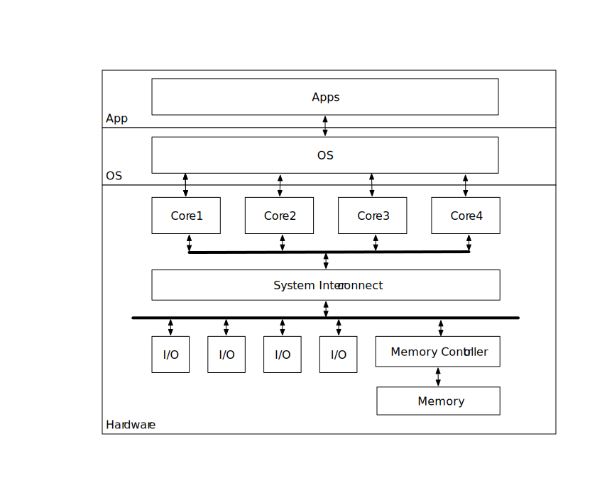
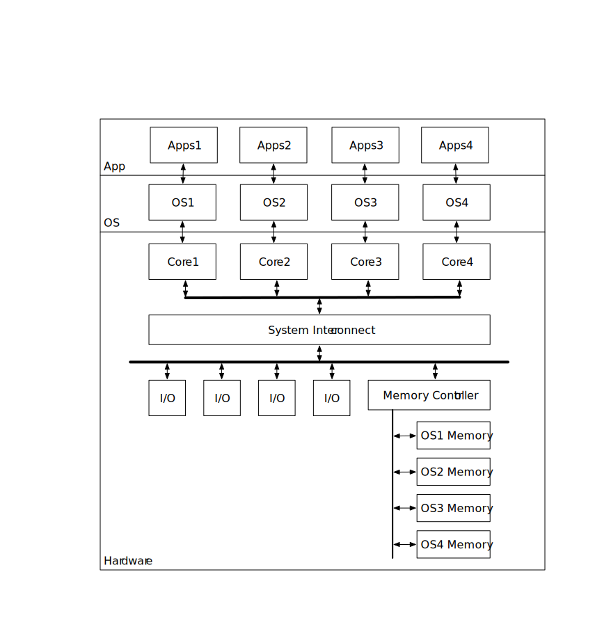

# 一种支持多级混合存储架构的嵌入式多核操作系统模型

## 摘要

近些年来，多核处理器越来越成为主流，由于嵌入式系统领域对计算能力的需求也越来越高，因此多核处理器也被广泛应用于嵌入式设备中。目前国内外对支持多核处理器的操作系统模型的研究，大多基于一种紧耦合共享存储架构的多核处理器，而对一些特殊架构处理器研究并不多。本文首先对传统嵌入式多核操作系统模型进行分析，然后给出一种支持多级混合存储架构的嵌入式多核操作系统模型。理论和实践证明了，本文提出的多核操作系统模型易于操作系统和用户应用的移植，并能充分发挥多级混合存储架构的优势。

**关键字：** 多核处理器, 多级混合存储, 多核操作系统

## 0. 引言

## 1. 传统嵌入式多核操作系统模型

###1.1 对称多处理 SMP

SMP 模型主要特点是只有一个操作系统镜像同时运行在所有核上，所有进程和资源的调度和管理以及核间通信均由操作系统负责。

###1.2 非对称多处理 AMP

###1.3 混合多处理 BMP

###1.4 三种模型的比较

##2 面临的问题

##3 设计与实现

###3.1 一种新的多核操作系统模型

###3.2 多核链接技术

###3.2 对单核操作系统所做的修改

##4 结束语

##参考文献

